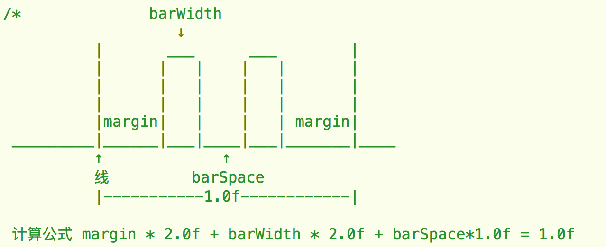

# XCharts
---
`XCharts` 是一款折线/曲线与柱状图绘制的框架, 通过 `XCharts` 你无需了解绘制的工作原理便能轻松的绘制出想要效果的图表

---

### 为什么使用XCharts

理由:

 - 支持曲线/折线, 能够自定义化界面达到90%, 即使不能达到想要的界面效果, 经过简单修改也能达到.

 -  支持缩放功能, `跟随手势缩放` `手势完成后缩放` `禁止缩放` 随你挑

 -  支持渐变色填充折线/曲线

 -  支持点击某一项后出现数值提示 (非pop形式)

 - 更多.... 

### 效果图


### 使用
- 导入工程

	1. 将 `XCharts` 全部拖入你的工程项目中;
	2. 引入 `XCharts.h` 头文件

- 绘制折线图

   你可以使用 `initWithFrame:` 方法来 创建一个 `XLineChartView` 折线/曲线视图, 具体是折线还是曲线, 取决于`chartType`的类型, 不过需要注意的是, 需要最后调用 `strokeChart` 方法来绘制曲线/折线. 实例代码如下:
   
   ````objc
   XLineChartView *chartView = [[XLineChartView alloc] initWithFrame:self.view.bounds]
    NSMutableArray *xTitles = [NSMutableArray array];
    NSMutableArray *yValues = [NSMutableArray array];
    for (int i = 0 ; i < 2; i ++) {
        NSMutableArray *yArr = [NSMutableArray array];
        int max = arc4random_uniform(1000)+300;
        for (int j = 0; j < 100; j ++) {
            if(i == 0) [xTitles addObject:[NSString stringWithFormat:@"第%d个",j]];
            [yArr addObject:[NSString stringWithFormat:@"%d",arc4random_uniform(max)]];
        }
        [yValues addObject:yArr];
    }
    chartView.xTitles = xTitles;    //设置X
    chartView.yValuesArray = yValues;  //设置Y   
    chartView.chartType = XChartLineTypeCurve;//设置绘制类型为曲线
    chartView.showDot = YES;   //设置显示圆点
    chartView.gradientEnable = YES;  //设置启用渐变填充
    [self.view addSubview:chartView];
    [chartView strokeChart];  //绘制曲线
   ````
   
 - 绘制柱状图
   
    你可以使用 `initWithFrame:` 方法来 创建一个 `XBarChartView` 柱状图视图,
    柱状图的柱形的背景颜色可以通过 `barBgColor` 来修改, 前景色一样通过 `chartColors` 来指定. 示例代码:
    
    ````objc   XBarChartView *chartView = [[XBarChartView alloc] initWithFrame:self.view.bounds]
    NSMutableArray *xTitles = [NSMutableArray array];
    NSMutableArray *yValues = [NSMutableArray array];
    for (int i = 0 ; i < 2; i ++) {
        NSMutableArray *yArr = [NSMutableArray array];
        int max = arc4random_uniform(1000)+300;
        for (int j = 0; j < 100; j ++) {
            if(i == 0) [xTitles addObject:[NSString stringWithFormat:@"第%d个",j]];
            [yArr addObject:[NSString stringWithFormat:@"%d",arc4random_uniform(max)]];
        }
        [yValues addObject:yArr];
    }
    chartView.xTitles = xTitles;    //设置X
    chartView.yValuesArray = yValues;  //设置Y   
    chartView.gradientEnable = YES;  //设置启用渐变填充
    [self.view addSubview:chartView];
    [chartView strokeChart];  //绘制曲线
    ````

### API解释

- 公共方法
 
	`xTitles` x 坐标的显示文字数组, 数组里面包含的是字符串

	`yValuesArray` 绘制的值数组, 数组里面包含的是值的数组, 例如 `@[@[@"23",@"33"],@[@"100",@"500"]]`

	`chartColors` 绘制线条/柱状图颜色的数组,数组里面的类型为`UIColors`
	
	`yUnit`  数值的单位, 用于显示在提示框中, 类型为`NSString`
	
	`dataNameArr` 数值类型名数组, 该数组的个数应当与`yValuesArray `个数相等, 用于显示在提示框中, 替换`值1`等等的提示
	
	`yLabNumber` Y轴上面显示的数值刻度个数
	 
	`labFont`  用于设置X,Y 轴显示文字的字体
	
	`xLabspace` 用于设置x轴,两个lab之间的间距
	
	`coordColor` 用于设置坐标轴颜色
	
	`coordWidth` 用于设置坐标轴的绘制线条宽度
	
	`contentView`  绘制区域的视图,可以设置背景色等等操作
	
	`animationEnable`  设置是否启用绘制动画
	
	`animationDuration` 设置绘制动画的持续时间
	
	`yAssistLineEnable` 设置是否绘制背景的横向显示辅助线
	
	`yAssistLineWidth` 设置绘制背景的横向显示辅助线的宽度
	
	`yAssistLineColor` 设置绘制背景的横向显示辅助线的颜色
	
	`xAssistLineEnable` 设置是否绘制背景的纵向显示辅助线
	
	`xAssistLineWidth` 设置绘制背景的纵向显示辅助线的宽度
	
	`xAssistLineColor` 设置绘制背景的纵向显示辅助线的颜色
	
	`markerBgColor` 设置提示的背景颜色
	
	`markerLineColor` 设置辅助提示线条的颜色
	
	`noDataLab` 没有数据显示的lab, 可以自定义文字与背景颜色
	
	
	
- XLineChartView 专属设置

	`strokeLineWidth` 设置绘制线条的宽度

	`showDot` 设置是否显示圆点
	
	`dotRadius` 设置显示圆点的半径
	
	`dotLineWidth` 设置显示圆点边框线的宽度
	
	`dotStrokeColors` 设置绘制圆点边框线的颜色, 类型为 `UIColor` 数量应该与 `yValuesArray `相等
	
	`dotFillColors` 设置绘制圆点填充颜色, 类型为 `UIColor` 数量应该与 `yValuesArray `相等
	
	`gradientEnable` 是否需要渐变色填充
	
	`gradientColors` 填充渐变色,内部数组格式示例 `(id)[UIColor redColor].CGColor` , 数量应该与 			`yValuesArray `相等
	
	`gradientLocations`  渐变色的locations 参考CAGradientLayer的locations
	
	`chartType` 绘制类型, 可选择曲线(`XChartLineTypeCurve`), 折线(`XChartLineTypePolyline`)
	
- XBarChartView 专属设置

	参数解释图
	
	
	
	`barWidth` 每个柱形的宽度 取值`0.0~1.0`
	
	`barSpace` 每个柱形之间的距离 取值`0.0~1.0`
	
	`margin` 每组数据的前后边距 取值`0.0~1.0`
	
	`barBgColor` 设置 柱形 的背景颜色
	
### 使用注意

- 实时缩放使用起来使用户的体验非常良好, 但是当数据很多的时候(>300),不同设备上的体检会有所不同

- 你可以根据需要无限制的调用 `strokeChart ` 来重新绘制你的图形, 但是在改变图表参数之后(除提示视图参数), 你必须手动调用一次 `strokeChart` 方法

- 推荐在 `iOS 7.0` 以后的系统上使用

### License

请遵循 MIT 协议使用, 转载请注明出处 ! 谢谢!
